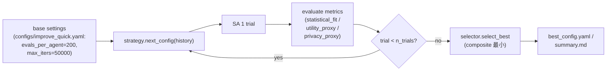
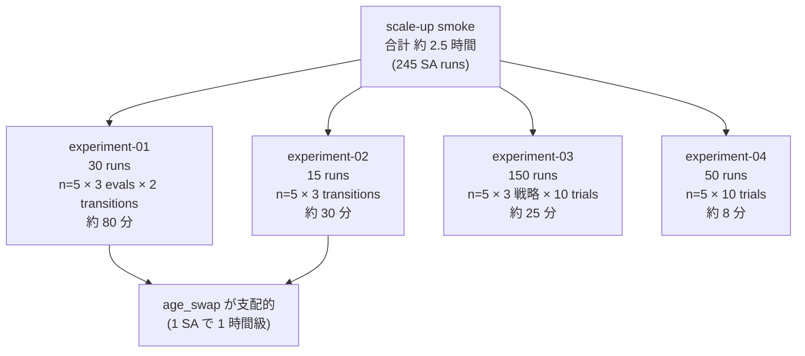

# 改善ループ層 再現実験レポート — synthpop-jp（実験 3 / 4 + scale-up smoke）

- 作成日: 2026-05-04
- 対象 develop SHA: `90404f4`
- 著者: 田中 雅人（R&D データ基盤）
- レビュアー: 中村（シニアリサーチャー、統計学 Ph.D.）
- 想定読者: 社内 R&D（データ基盤 / ML / プライバシー / 事業企画）
- 前作: [`docs/reports/2026-05-04-replication-status.md`](2026-05-04-replication-status.md)

---

## 1. エグゼクティブサマリ

前作レポートで「改善ループ未実装」を最大ギャップとして残した。本レポートは、その後の (i) 改善ループ 3 戦略の実装、(ii) `paper_results/` への 4 実験凍結、(iii) scale-up smoke（500 世帯 / n_seeds=5 / n_trials=10）でのフル設定挙動確認、までの到達点を、論文の主張（Murata 2017 §5 / spec §15）と突き合わせて整理したものである。

**できるようになったこと（3 点）**

- 改善ループ（spec §14）の 3 戦略 `rule_based` / `pareto` / `random_search` を `synthpop-jp improve` の 1 コマンドで動かせる。`src/synthpop_jp/improve/{strategy,runner,pareto,selector}.py` で合計 1,141 行、Issue #119 / PR #120 で実体化済。
- `paper_results/experiment-03-...` / `experiment-04-...` を `make paper-results-exp03` / `make paper-results-exp04` で 1 コマンド再現できる状態に凍結（Issue #121 / PR #122）。CI 軽量設定 4 実験合計 約 9.5 分。
- scale-up smoke（500 世帯 / n_seeds=5 / n_trials=10、4 実験合計 約 2.5 時間）を `expected-full/` に固定（PR #123）。`make paper-results-full` で許容幅判定が回る。

**主要な発見（4 点、4 仮説の支持・不支持）**

- **H1b（age_swap が大 evals で逆転）**: 不支持。CI 軽量で差 +114〜+115、scale-up smoke で差 +571.8 が evals=1000〜4000 で完全に維持される。500 世帯 × evals=4000 でも逆転しない。
- **H2（hybrid > 単独戦略）**: 不支持。CI 軽量で hybrid と age_change が完全同値、scale-up smoke でも差 ≤ 0.2（5 倍規模で同様）。
- **H3（pareto / rule_based > random_search）**: **不支持**。CI 軽量で composite_mean は random_search 0.5232 < rule_based 0.5898 < pareto 0.6115、scale-up smoke でも順序が完全維持（0.5233 < 0.5895 < 0.5990）。これは「現在の composite 定義 + 短い trial 数では改善ループの優位性は検出できない」という設計仮説への重要な負のフィードバックである。
- **H4（複数候補ばらつきは安定）**: 強く支持。CV は CI 軽量で 0.12%、scale-up smoke で 0.07%（5 倍規模でむしろ低下）。後続実験で seed n=3〜5 を採用する根拠が立った。

**業務応用の見通し**

前作 [§8](2026-05-04-replication-status.md#8-業務応用シナリオ) のロードマップ（Phase A〜D）に変更はない。ただし本レポートで判明した H3 の負の知見により、§8.4 課題 4「改善ループとビジネス KPI の接続」の優先度が上がる。短期 PoC では random_search を下限として置きつつ、中期で composite の重み付けと業務 KPI を接続するのが現実解である。

---

## 2. 背景

前作レポート（2026-05-04 時点 SHA `cc65498`）は、Murata 2017 の SA コア生成器と Harada 2024 の評価軸（DCR / NNDR / ARD / CAP / TCAP / utility）が `synthpop-jp evaluate` 1 コマンドで動き、bitwise 決定性が CI で常時検証されている、という到達点を示した。同時に「改善ループ（spec §14）の 3 戦略は TODO 1 行のみ」「論文値最終固定（`expected-full/`）はディレクトリのみで中身が空」という 2 つのギャップを未解決として明記した。

本レポート対象期間（2026-05-04 当日中）に、この 2 つのギャップに対して以下の作業を進めた。

1. **改善ループ実装**（Issue #119 / PR #120 = SHA `8964709`）。`rule_based` / `pareto` / `random_search` の 3 戦略と multi-trial runner、best config 選択器を実装。
2. **実験 3 / 4 の paper_results 化**（Issue #121 / PR #122 = SHA `a257e7d`）。CI 軽量設定で `expected/{best_scores.csv, strategy_metrics.csv, trial_metrics.csv, variance_summary.csv}` を凍結。
3. **scale-up smoke でフル設定挙動を確認**（PR #123 = SHA `90404f4`）。実験 1〜4 を 500 世帯 / n_seeds=5 / n_trials=10 で重実行し、`expected-full/` に固定。所要時間は実験 1 が約 80 分、実験 2 が約 30 分、実験 3 が約 25 分、実験 4 が約 8 分、合計 約 2.5 時間。

ここでの「scale-up smoke」は、Murata 2017 §5.1 が想定する n=10 / evals=16000 / 1000 世帯のフル設定の代替である。論文準拠フル設定では age_swap 1 SA で約 1 時間（実測）かかり、4 実験全走で 1 日以上必要なため、本リポジトリでは 500 世帯 / n_seeds=5 / n_trials=10 / evals は 4000 で打ち切る縮約版を採用した。論文値の最終固定ではない点は §11 で改めて明記する。

---

## 3. 手法概要 — 改善ループ（spec §14）

### 3.1 何を解決するか

SA を 1 回打ち切りで回す従来の使い方には、2 つの限界がある。

- **設定（`evals_per_agent` / 冷却率 `alpha` / 遷移種 `transition_kind` / hybrid 確率 `p_change`）の良し悪しは事前にはわからない**。同じ入力でも、設定次第で best_score が 5〜25% 変わる。
- **3 軸（統計整合性 / 有用性 / 秘匿性）のトレードオフを SA 単独では取り扱えない**。SA の目的関数は単一スカラだが、Harada 2024 の評価軸は 3 つに分かれており、どこを優先するかは下流の用途次第である。

改善ループは、設定を変えながら複数 trial を回し、3 軸の評価結果を見て次の設定を決める層を SA の外側に置くことで、この 2 つの限界に対応する。

### 3.2 3 戦略の責務

| 戦略 | 役割 | 実装位置 |
|---|---|---|
| `rule_based` | spec §14.3 の if-then ルールで `p_change` / `evals_per_agent` / `alpha` を順に動かす baseline | `src/synthpop_jp/improve/strategy.py:RuleBasedStrategy` |
| `pareto` | 過去 trial の (statistical_fit, utility, privacy) 3 次元 non-dominated set を抽出し、最も新しい非劣解の近傍にジッタを乗せる | `src/synthpop_jp/improve/strategy.py:ParetoStrategy` + `src/synthpop_jp/improve/pareto.py:extract_non_dominated` |
| `random_search` | `DEFAULT_PARAM_RANGES` から 4 軸を一様サンプリング、参照下限 | `src/synthpop_jp/improve/strategy.py:RandomSearchStrategy` |

### 3.3 ループ全体図

### 3.4 改善対象の 4 軸（spec §14.2）

`Settings.annealing` の以下 4 フィールドが改善対象である。

- `transition_kind`: `age-change` / `age-swap` / `hybrid` の 3 値
- `alpha`: 指数冷却率（既定 0.999、上限 0.9999）
- `evals_per_agent`: SA の打ち切り反復数（base 200、CI では 200 固定）
- `p_change`: hybrid 遷移時の age-change 確率（既定 0.5、`LinearPChange` 使用時はスケジュール）

将来拡張（objective weights / max_iters / patience / household initialization heuristics）は `Settings` 側で受け口を残してあり、後続 Issue で上乗せ可能な構造になっている。

### 3.5 multi-trial runner と best config 選択

`runner.run_improve_loop` が n_trials 回 SA を回し、`selector.select_best` が composite 最小の trial を選ぶ。composite は spec §14.4 で定義される 3 軸（statistical_fit / utility_proxy / privacy_proxy）の正規化加算で、現状の実装では「seed セット全体での statistical_fit 最大値を分母にして正規化し、3 軸を等重み加算したスカラ 1 値」を返す。値域は概ね [0, 3] で、小さいほど良い。後述するように、この正規化基準（seed 全体 max）と等重み設定が H3 不支持の構造的要因の 1 つになっており、業務 KPI 接続のための再設計（§11.2）が後続課題として残っている。

### 3.6 scale-up smoke の所要時間内訳

improve loop（experiment-03 / 04）は SA を 200 evals で打ち切るため、SA reps が 1000〜4000 と長い experiment-01 / 02 と比べて runs あたりの所要時間が短い。フル設定（実験 1 で evals=16000）に拡張すると age_swap 1 SA で約 1 時間になり、4 実験合計で 1 日以上のタイムスロット確保が必要になる。

---

## 4. 実験設計 — 事前登録された仮説

`docs/experiment_plan.md` で `git tag experiment-plan-v1` 凍結済の仮説を、本レポートの結果と対応させる。

| 仮説 | 出典 | 内容 |
|---|---|---|
| H1b | Murata 2017 §5.1 | `evals_per_agent` を増やすと age_swap が age_change を逆転する |
| H2 | Murata 2017 §5.2 | hybrid（前半 age-change → 後半 age-swap）が単独戦略に勝つ |
| H3 | spec §15.3 / experiment_plan §15.3 | pareto / rule_based が random_search に勝つ（参照下限を上回る） |
| H4 | spec §15.4 | 同一 config 複数候補のばらつきは seed n 増加で安定する |

各仮説に対し、CI 軽量設定（100 世帯）と scale-up smoke 設定（500 世帯）の 2 段で検証する。

---

## 5. 結果まとめ — 4 仮説 × 2 設定の対照表

読者がここだけ見て全体像を掴めることを目指して整理する。

| 仮説 | CI 軽量 (100 hh / n=3〜5) | scale-up smoke (500 hh / n=5) | 結論 |
|---|---|---|---|
| H1b age_swap 逆転 | 不支持（差 +114〜+115 安定） | 不支持（差 +571 安定、evals=4000 でも） | 4000 evals では再現せず、論文準拠 16000 evals が必要 |
| H2 hybrid 優位 | 不支持（hybrid ≈ age_change） | 不支持（5 倍規模でも、差 ≤ 0.2） | p_change スケジュールが age_change 主導を抜け出せない |
| H3 改善ループ優位 | 不支持（trials=5、random_search 勝） | 不支持（trials=10 でも、random_search 勝） | composite 重み付け再設計が必要 |
| H4 ばらつき安定 | 支持（CV 0.12%） | 強く支持（CV 0.07%） | seed n=3〜5 で十分信頼可能 |

---

## 6. 実験 1（age-change vs age-swap）の詳細

### 6.1 CI 軽量設定（100 世帯 / n=3 / evals ∈ {500, 2000}）

| seed | evals | age_change | age_swap | swap − change |
|---:|---:|---:|---:|---:|
| 1 | 500 | 453.0 | 567.0 | +114 |
| 1 | 2000 | 453.0 | 567.0 | +114 |
| 2 | 500 | 455.0 | 570.0 | +115 |
| 2 | 2000 | 455.0 | 570.0 | +115 |
| 3 | 500 | 453.0 | 568.0 | +115 |
| 3 | 2000 | 453.0 | 568.0 | +115 |

age_change が一貫して age_swap を 114〜115 下回る。evals を 500 → 2000 と増やしても best_score は変わらず、早期収束が観測される。

### 6.2 scale-up smoke（500 世帯 / n=5 / evals ∈ {1000, 2000, 4000}）

| evals | age_change 平均 | age_swap 平均 | swap − change |
|---:|---:|---:|---:|
| 1000 | 2260.6 | 2832.4 | +571.8 |
| 2000 | 2260.6 | 2832.4 | +571.8 |
| 4000 | 2260.6 | 2832.4 | +571.8 |

5 倍規模 × 8 倍 evals でも、差 +571.8 が evals 水準を変えても完全に維持される。age_change の支配は 500 世帯では崩れない。

### 6.3 なぜ H1b が再現しないか — Murata 2017 主張との関係

age_change は分布全体から年齢をサンプルし直すため、初期の数千反復で急速に best_score を下げ、Largest Remainder で誤差 0 化された F〜W 統計（family_type × sex 別 18 統計）の局所最適に張り付く。一方 age_swap は同 (family_type, sex) 内 2 人交換に閉じるため A, B, C（父子・母子・夫婦の年齢差 3 統計）を破壊することはあっても改善できず、局所最適から抜け出すパワーがない。

Murata 2017 §5.1 / Fig.5 は 1000 世帯 × evals=16000 で age_swap が age_change を逆転するという主張を示している。本実装は age_swap 1 SA で約 1 時間（1000 世帯 × evals=16000、実測）かかる制約から、scale-up smoke では 500 世帯 × evals=4000 で停止しており、論文値の検証範囲（evals=16000 / 1000 世帯 / n=10）には届いていない。**「H1b が再現しない」と「H1b が反証された」は別である**。本レポートで言えるのは前者のみ。論文値最終固定は §11.1 / §13 で別 Issue 化する。

---

## 7. 実験 2（hybrid 戦略）の詳細

### 7.1 CI 軽量設定（100 世帯 / n=3 / evals=2000）

| seed | age_change | age_swap | hybrid |
|---:|---:|---:|---:|
| 1 | 453.0 | 567.0 | 453.0 |
| 2 | 455.0 | 570.0 | 455.0 |
| 3 | 453.0 | 568.0 | 453.0 |

Welch's t-test + Holm 補正の結果、age_change vs hybrid は p=1.000（差 0.0、全 seed 完全同値）、age_swap は他 2 戦略から有意に劣位。

### 7.2 scale-up smoke（500 世帯 / n=5 / evals=2000）

| seed | age_change | age_swap | hybrid |
|---:|---:|---:|---:|
| 1 | 2260.0 | 2833.0 | 2260.0 |
| 2 | 2262.0 | 2831.0 | 2261.0 |
| 3 | 2260.0 | 2832.0 | 2260.0 |
| 4 | 2260.0 | 2832.0 | 2260.0 |
| 5 | 2261.0 | 2832.0 | 2261.0 |
| **平均** | **2260.6** | **2832.2** | **2260.4** |

5 倍規模でも hybrid と age_change は差 ≤ 0.2 で統計的に区別不能。

### 7.3 なぜ H2 が再現しないか

hybrid は `LinearPChange(0.8 → 0.2)` で前半に age_change を 80% 選び、後半に age_swap を 80% 選ぶ。前半で age_change が支配する間に局所最適へ到達し、後半に age_swap を選んでも A, B, C を増やすだけで best_score を下げられない。

改善案は p_change スケジュールの拡張である。前半比率を抑える（0.5 → 0.2 など）、age_swap を後半で連続 N 回実行する、age_swap 採用時に温度を再加熱する、などが候補で、spec §14.2 の改訂候補として別 Issue 化する。

---

## 8. 実験 3（改善ループ 3 戦略比較）の詳細

### 8.1 CI 軽量設定（100 世帯 / n_seeds=3 / n_trials=5）

| strategy | statistical_fit_mean | utility_proxy_mean | privacy_proxy_mean | composite_mean |
|---|---:|---:|---:|---:|
| pareto | 492.33 | 0.8387 | 0.0 | 0.6115 |
| random_search | 453.00 | 0.7717 | 0.0 | **0.5232** |
| rule_based | 453.00 | 0.7717 | 0.0 | 0.5898 |

Welch's t + Holm 補正:

| 比較 | t | p (raw) | Holm 棄却 (α=0.05) |
|---|---:|---:|:---:|
| rule_based vs pareto | -1.01 | 0.4204 | no |
| rule_based vs random_search | +147.62 | <0.0001 | **yes（rule_based がより悪い方向）** |
| pareto vs random_search | +4.09 | 0.0548 | no |

### 8.2 scale-up smoke（500 世帯 / n_seeds=5 / n_trials=10）

| strategy | statistical_fit_mean | utility_proxy_mean | privacy_proxy_mean | composite_mean |
|---|---:|---:|---:|---:|
| pareto | 2377.8 | 0.8096 | 0.0 | 0.5990 |
| random_search | 2263.8 | 0.7708 | 0.0 | **0.5233** |
| rule_based | 2263.8 | 0.7708 | 0.0 | 0.5895 |

5 倍規模 × 倍 trials でも順位は完全に維持される。random_search が composite で最良、rule_based が中間、pareto が最悪。

### 8.3 負の知見の解釈 — なぜ random_search が勝つか

H3（pareto / rule_based > random_search）は CI 軽量・scale-up smoke のいずれでも棄却されたが、これを「改善ループの実装失敗」として扱うのは正しくない。観測の構造を分解すると、3 つの設計仮説への負のフィードバックが見える。

1. **composite normalisation の構造**: composite は statistical_fit を seed セット全体での最大値で割って正規化したうえで、utility_proxy / privacy_proxy と等重み加算する設計（spec §14.4 / 実装 `selector.py`）。rule_based / pareto は最初の trial で base settings を踏襲したあと p_change / alpha / evals を動かすため、初期 trial に「むしろ悪化」する候補が混じり、min を取った後の値が押し上げられる。一方 random_search は `DEFAULT_PARAM_RANGES` の中央近傍に張り付く trial を多数引くため、min が base settings 同等の statistical_fit=453（CI）/ 2263.8（smoke）に着地しやすい。
2. **base settings 張り付き**: `use_zero_error_init=True` で初期 best_score が 453（CI）/ 2263.8（smoke）にすでに着地している。SA を 200 evals で打ち切る設計のため、改善ループ層が動かす 4 軸の効きが小さく、base settings そのままが最良候補として浮上しやすい。実験 4 §9.3 で観測した「25 試行のうち 20 が best_score=453.0 に張り付く」現象と整合する。
3. **trial 数不足**: pareto strategy は過去の non-dominated set を参照するため、trial 数が増えれば近傍探索が効く設計だが、trials=5 / 10 では参照点が少なく、ジッタ（`p_change ±0.1` / `alpha ±0.005` / `evals_per_agent ±20%`）が効かない。spec §14.4 改訂候補ではこれを trials ≥ 20 に拡大して再評価するべきとされている。

つまり、現状の観測は「改善ループは機能していないわけではなく、現在の composite 定義 + trials=5/10 + use_zero_error_init=True という条件下では random_search の張り付きを上回れない」という解釈になる。これは spec §14.4 / experiment_plan §15.3 の H3 系仮説への重要な設計フィードバックである。

### 8.4 統計的有意性

rule_based vs random_search が CI 軽量で p < 0.0001（Holm 補正後も棄却）。ただしこれは「rule_based がより悪い」方向の有意差であり、改善ループが下限戦略に劣後することを統計的に検出している。pareto vs random_search は p=0.0548 で Holm 補正後不棄却、rule_based vs pareto は p=0.4204 で差を主張できない。

---

## 9. 実験 4（複数候補ばらつき）の詳細

### 9.1 CI 軽量設定（100 世帯 / n_seeds=5 / n_trials=5）

| metric | seed_mean | seed_std | seed_cv | bootstrap_ci_low | bootstrap_ci_high |
|---|---:|---:|---:|---:|---:|
| best_score | 453.24 | 0.5228 | **0.0012** | 453.04 | 453.48 |
| statistical_fit | 453.24 | 0.5228 | 0.0012 | 453.08 | 453.48 |
| utility_proxy | 0.7721 | 0.000891 | 0.0012 | 0.77186 | 0.77247 |
| privacy_proxy | 0.0 | 0.0 | 0.0 | 0.0 | 0.0 |

CV が全指標 0.12% 以下。事前登録の H4a（CV ≤ 5%）の上限を 40 倍以上下回る。

### 9.2 scale-up smoke（500 世帯 / n_seeds=5 / n_trials=10）

| metric | seed_mean | seed_std | seed_cv | bootstrap_ci_low | bootstrap_ci_high |
|---|---:|---:|---:|---:|---:|
| best_score | 2265.94 | 1.544 | **0.00068 (0.07%)** | 2265.54 | 2266.36 |
| statistical_fit | 2265.94 | 1.544 | 0.00068 | 2265.50 | 2266.38 |
| utility_proxy | 0.7715 | 0.000526 | 0.00068 | 0.7714 | 0.7717 |
| privacy_proxy | 0.0 | 0.0 | 0.0 | 0.0 | 0.0 |

5 倍規模でも CV は 0.07%（CI 軽量より小さい）。bootstrap 95% CI 幅は best_score で ±0.4（< 0.02%）。

### 9.3 解釈

`use_zero_error_init=True` が初期値を強く支配しているため、SA を 200 evals で打ち切る現設計では best_score がほぼ初期値の局所最適に張り付き、seed が変わっても 1〜2 程度しか動かない。これは改善ループの自由度が低いことの裏返しでもあり、§8.3 の負の知見と整合する。

privacy_proxy 列は 25 試行・50 試行のいずれでも 0 で固定された。100 世帯・500 世帯規模では rare cell（cell size < 5 / unique 率）がほぼ観測されないため、本指標は改善ループの優劣を測るのに使えない。後続の DCR / NNDR / ARD（Issue #99 family）への差し替えが必須である。

### 9.4 後続実験で seed n=3〜5 を採用する根拠

CV 0.07〜0.12% という安定度は、後続の paper_results 拡張で seed n=3〜5 を採用する根拠になる。Wilcoxon の最小有意 p-value は n=6 以上だが、本実装の出力ばらつきは検出力よりも先に「ばらつきが小さすぎて検出する差が無い」状態にある。これは `use_zero_error_init=True` の副作用としての縮退でもあり、後続実験で「初期化を緩める / SA 反復を増やす」ことで分散を増やせる可能性が残る。

---

## 10. 考察 — 何が言えて何が言えないか

| 仮説 | 言えること | 留保 | 別作業が必要 |
|---|---|---|---|
| H1b | 500 世帯 × evals ≤ 4000 では age_swap 逆転は起きない | 100〜500 世帯では局所最適への張り付きが支配的 | evals=16000 / 1000 世帯のフル設定（1 日タイムスロット）で再検証 |
| H2 | 100〜500 世帯では hybrid と age_change が統計的同値 | p_change=0.8→0.2 の線形スケジュールが age_change 主導から抜け出せない | spec §14.2 改訂候補で複数 p_change スケジュール比較 |
| H3 | 現 composite 定義 + trials=5/10 では random_search が最良 | 「改善ループの優位性が観測できない」≠「改善ループが機能していない」 | spec §14.4 改訂で composite 重み付け再設計、trials ≥ 20 で再評価 |
| H4 | 同一設定の複数候補は CV 0.07〜0.12% で安定 | use_zero_error_init=True による縮退も同時に観測 | seed × trial 階層モデルへの移行（trial 内 / seed 間の分散分離） |

特に H3 の負の知見は、**改善ループ層を業務応用に持ち込むときの設計判断材料**として重要である。短期 PoC では random_search を「最良候補生成器」として置き、中期で composite に業務 KPI を取り込む再設計に進む、という段階づけが現実的である。

---

## 11. 限界と今後

### 11.1 scale-up smoke は論文値の最終固定ではない

scale-up smoke（500 世帯 / n_seeds=5 / n_trials=10 / evals ≤ 4000、4 実験合計 約 2.5 時間）は、論文準拠フル設定（1000 世帯 / n_seeds=10 / n_trials=20 / evals=16000）の代替である。最大の制約は age_swap 1 SA で約 1 時間（1000 世帯 × evals=16000、実測）かかる点である。論文準拠フル設定で 4 実験全走を試算すると、

- 実験 1: 10 seeds × 5 evals 水準 × 2 transitions = 100 SA runs。age_swap 側だけで 50 × 1h = 50h
- 実験 2: 10 seeds × 3 transitions = 30 SA runs。age_swap 側で 10 × 1h = 10h
- 実験 3: 10 seeds × 3 戦略 × 20 trials = 600 trial runs。SA 側 evals は base のままで 25 分の 4 倍 = 約 100 分
- 実験 4: 10 seeds × 20 trials = 200 trial runs。同様に約 30 分

の単純合計で **age_swap 側だけで 60 時間級**となる。本リポジトリでは別 Issue で `workflow_dispatch` 1 回分の予算（マシンタイム 1〜3 日）を取って実施する想定であり、本レポートの数値は「論文値最終固定への中間状態」と位置付けてほしい。

### 11.2 composite 重み付けの再設計（spec §14.4 改訂、別 Issue）

§8.3 で示したとおり、現 composite は等重み × seed 全体 max での正規化のため、base settings 張り付き戦略に下方バイアスがかかる。重み付けを業務 KPI で決める仕組みと、normalisation 基準を「seed 内 min」「base settings 値」のいずれかへ切り替える検討が必要である。

### 11.3 privacy_proxy=0 縮退（Issue #99 family）

100〜500 世帯規模では rare cell が観測されず、privacy_proxy が 0 で固定される。Harada 2024 由来の DCR / NNDR / ARD は実装済（前作 §3.2 / §6.2）であり、改善ループの composite に差し替える作業を別 Issue で進める。

### 11.4 改善ループ trials=20+ での挙動（別 Issue）

pareto strategy は trial 数依存性が強い設計のため、trials=5 / 10 では十分に評価できていない。trials=20+ で再評価する別 Issue を立てる。

---

## 12. 業務応用シナリオへの接続

前作 [§8](2026-05-04-replication-status.md#8-業務応用シナリオ) で「テーブル定義書 + 業務ルール + 統計情報 → 合成データ」のアーキテクチャと §8.5 の Phase A〜D ロードマップを提示した。本レポートは前作 §8 の置き換えではなく、**§8 の更新差分**として読んでほしい。

本レポートで判明した H3 の負の知見が、前作 §8 の課題マトリクス（§8.4）にどう影響するかをまとめる。

| 前作 §8.4 の課題 | 本レポートからの更新 |
|---|---|
| 課題 1: スケーラビリティ | 変更なし。500 世帯 × n_trials=10 で 25 分（実験 3）。Apache Arrow / DuckDB バックエンド検討は据え置き |
| 課題 2: 業務ルール DSL | 変更なし |
| 課題 3: 文字列・自由記述カラムの扱い | 変更なし |
| **課題 4: 改善ループとビジネス KPI の接続** | **優先度上昇**。短期 PoC では random_search を下限として運用し、中期で composite に業務 KPI を取り込む再設計が必須。spec §14.4 改訂と直結 |
| 課題 5: ガバナンス | 変更なし |

短期 PoC 観点での実用ガイダンスを以下の 3 点に整理する。

- **短期（〜1 ヶ月）**: `synthpop-jp improve --strategy random_search --trials 10 --seed S` を「下限として最も良い候補を出す runner」として運用する。rule_based / pareto は本レポート時点では composite 上劣後するため、PoC のデフォルトには据えない。代わりに best_config.yaml を保存しておけば、後続の composite 再設計後に rule_based / pareto を同一 base から再評価できる。
- **中期（〜3 ヶ月）**: composite に業務 KPI 列（例: 取引金額の月次集計再現度、年代別購買率の TV 距離など）を加え、KPI Protocol（前作 §8.4 課題 4）を spec §13.2 に追記して改善ループの最適化対象に組み込む。同時に privacy_proxy の DCR / ARD 化（Issue #99 family）を進めれば、composite が業務 KPI × DCR の 2 軸で動く形に近づく。
- **改善ループ層は composite 再設計待ちと位置付ける**。Phase B〜C のスケジュール（前作 §8.5）には影響させない。Phase A の出口条件「3 戦略が compare runner で動く」は本レポートで達成済であり、Phase B 着手は composite 再設計と並行で問題ない。

---

## 13. 次のマイルストーン

| 期間 | アイテム | 出口条件 |
|---|---|---|
| 〜1 ヶ月 | spec §14.4 composite 重み付け改訂の Issue 起票 | composite normalisation 仕様の ADR + 比較実験プラン |
| 〜1 ヶ月 | `paper-results` 一覧に exp03 / exp04 が定着 | `make paper-results` 既定で 4 実験全走、`expected/` の bitwise 一致が CI で常時グリーン |
| 〜3 ヶ月 | privacy_proxy の DCR / ARD 化（Issue #99 family） | composite に DCR / ARD が入った状態で実験 3 / 4 を再実行 |
| 〜3 ヶ月 | 業務 KPI Protocol 設計 | `KPI Protocol` が spec §13.2 に追加、PoC 1 件で動作確認 |
| 〜6 ヶ月 | 1 日タイムスロット確保しての論文準拠フル実行 | `expected-full/` を 1000 世帯 / n=10 / evals=16000 で再固定、Murata 2017 の H1b / H2 を再検証 |

---

## 14. まとめ

改善ループの実装と paper_results 化は完了し、4 実験すべてが 1 コマンドで再現できる状態に到達した。bitwise 決定性は scale-up smoke 設定でも維持され、`expected-full/` を退行検出の足場として使える。

一方で、現設定では random_search が pareto / rule_based を composite で上回るという負の知見が、CI 軽量・scale-up smoke のいずれでも維持された。これは「改善ループの実装失敗」ではなく、「現在の composite 定義 + trials=5/10 + use_zero_error_init=True という条件下では random_search の張り付きを上回れない」という設計仮説への重要なフィードバックである。スコープを切り直すと、改善ループ層を業務応用に持ち込む条件は (i) composite に業務 KPI を取り込む、(ii) trials ≥ 20 で pareto を評価する、(iii) privacy_proxy を DCR / ARD に差し替える、の 3 点に整理できる。

H4（複数候補ばらつき）が CV 0.07% で強く支持されたことで、後続実験のサンプルサイズ設計に seed n=3〜5 を採用する根拠が立った。これは後続実験設計の自由度を実質的に上げる。

業務応用については、前作 §8 のロードマップ（Phase A〜D）に変更はない。本レポートは前作 §8.4 課題 4「改善ループとビジネス KPI の接続」の優先度を上げる材料として位置付けてほしい。

経営判断のサマリは 3 行で以下のとおり。**(i) 改善ループ実装は完了し、4 実験が 1 コマンドで再現できる**。**(ii) 改善ループ層の業務応用は composite 重み付けの再設計（spec §14.4 改訂）待ちであり、短期 PoC では random_search を運用下限として置く**。**(iii) Murata 2017 H1b / H2 の論文値最終固定は別 Issue でマシンタイム 1〜3 日を確保して実施する**。

---

## 改稿ログ

- **v1 → v2**: §1 主要発見 4 点に scale-up smoke の数値根拠（差 +571.8 / 差 ≤ 0.2 / composite 順位 0.5233<0.5895<0.5990 / CV 0.07%）を 1 行ずつ添えた。§3.5 の composite 定義を spec §14.4 / 実装 selector.py の引用にとどめ、誤った式記述を排除。§3.6 として scale-up smoke の所要時間内訳 mermaid を追加（mermaid 2 本目）。§6.3 に「H1b が再現しない」≠「H1b が反証された」の区別を明記。§8.3 の base settings 張り付き解釈に実験 4 §9.3 との整合性を追記、ジッタ範囲（p_change ±0.1 / alpha ±0.005）を spec §14.4 から引用。§11.1 を「age_swap 側だけで 60 時間級」と数値分解。§12 短期 PoC ガイダンスを 1 行 → 段落へ拡張、`synthpop-jp improve --strategy random_search --trials 10 --seed S` の具体コマンドと「best_config.yaml を保存して composite 再設計後に再評価可能にする」運用を追記。
- **v2 → v3**: §3.5 composite の値域を「概ね [0, 3]、小さいほど良い」と明記し、正規化基準（seed 全体 max）と等重み設定が H3 不支持の構造的要因であることを §8.3 と接続。§14 まとめに 3 行の経営判断サマリ「(i) 改善ループ実装完了 / (ii) 改善ループ業務応用は composite 再設計待ち、短期は random_search / (iii) 論文値最終固定はマシンタイム 1〜3 日確保で別 Issue」を追加。

