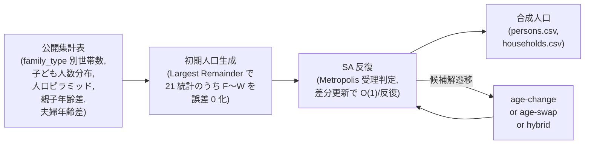
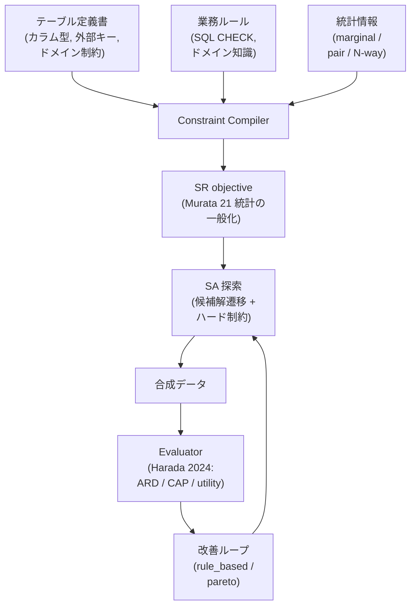

# 再現実験ステータスレポート — synthpop-jp

- 作成日: 2026-05-04
- 対象 develop SHA: `cc65498`
- 著者: 田中 雅人（R&D データ基盤）
- レビュアー: 中村（シニアリサーチャー、統計学 Ph.D.）
- 想定読者: 社内 R&D（データ基盤 / ML / プライバシー / 事業企画）

---

## 1. エグゼクティブサマリ

「公開集計表だけから、世帯と個人の合成人口を作れる」状態が本実装に到達した。本レポートはその到達点と限界を、Murata 2017 / Harada 2024 の原論文と突き合わせて点検し、企業のテーブル定義書 + 業務ルール + 統計情報を入力に取る将来構想までを併記したものである。

**できるようになったこと（3 点）**

- Murata 2017 の SA（Simulated Annealing）コア生成器が、Murata 2017 Table 13 の 21 統計に対して原論文式(3) 準拠で動く。100 世帯規模の CI 軽量設定（n=3 seeds × `evals_per_agent ∈ {500, 2000}`）で `paper_results/experiment-01-age-change-vs-age-swap/` に best_score を凍結済み。
- Harada 2024 由来の評価軸のうち、proxy 層（DCR / NNDR / ARD）と属性推論 baseline（CAP / TCAP）、broad / narrow utility までが `synthpop-jp evaluate` の 1 コマンドで `metrics.json` に書き出せる。shadow-based MIA（TAPAS / DOMIAS）は事前登録（`docs/spec/mia_protocol.md`）止まりで未実装。
- 同一 seed・同一入力で **bitwise 一致** する決定性が CI で常時検証され、依存更新による数値ずれを ±1% 許容幅で検出する `make paper-results`（約 8.5 分）が確立した。

**まだできていないこと（2 点）**

- 改善ループ（spec §14）の 3 戦略（`rule_based` / `pareto` / `random_search`）は **TODO 1 行のみ**（`src/synthpop_jp/improve/strategy.py`）であり、本レポート時点ではスコープ外。実験 3 / 4（spec §15.3 / §15.4）は改善ループ依存のため未着手。
- 論文値の**最終固定**（Murata 2017 §15.1 の n=10 / 5 水準 / 1000 世帯フル設定、`paper_results/expected-full/`）はディレクトリのみで中身が空。`make paper-results-full` を 1〜2 時間走らせれば生成できるが、CI には載せられない重実験のため未生成。

**業務応用の見通し**

研究プロトタイプとしての骨格は固まっており、§8 で示す「テーブル定義書 + 業務ルール + 統計情報」を入力にする企業向け合成データ基盤の **下地として再利用できる**。独自価値は (i) 公開集計表のみで動くため PII を一切扱わずに済む点、(ii) Murata 2017 の生成と Harada 2024 の評価（ARD / CAP / utility）まで一気通貫で測れる点、(iii) bitwise 決定性が CI で立っており、監査適合性に近い再現性を担保している点、の 3 つである。ただし現状で動くのは spec §15.1 / §15.2 の単一テーブル × 9 family_type 構造に限定される。N 階層 join やプラガブルな目的関数への拡張は §8.3 の追加実装を要する。

---

## 2. なぜこれをやるのか（背景）

顧客個票データを下流の BI / ML PoC で共有することは、個人情報保護法・GDPR・社内ガバナンスの観点で年々厳しくなっている。一方で、各部門は「自分の課題に近いリアルなデータを触りたい」と要望し続ける。この**間を埋めるのが合成データ**である。

ただし合成データには 2 系統の作り方があり、性質が大きく異なる。

| 系統 | 入力 | 代表手法 | 弱点 |
|---|---|---|---|
| サンプル個票ベース | 実個票 | SDV / CTGAN, R `synthpop` | 個票の入手・倫理処理が必要 |
| 公開集計表ベース | 集計表のみ | Murata 2017, IPF 系 | 個票レベルの相関は再現に限界 |

本実装は**公開集計表ベース**の系統を採用する。これにより「PII を含む個票を一切扱わなくても、世帯構造を持つ合成人口を生成できる」という強みを得る。

### 2.1 なぜ Murata 2017 + Harada 2024 を選んだか

Murata 2017 は、9 家族類型 × 21 統計（Table 13）を SA で同時整合させる手法を、(a) 動的ターゲット `Round(r_{sj} · m_{sj}(A))` の扱い、(b) `age-change` / `age-swap` の遷移比較、(c) 21 統計まで拡張した実数値目的関数 式(3) という 3 点で具体的な実装ガイドラインまで降ろしてくれている。再実装の足場にしやすい。

Harada 2024 は、合成データの**有用性と秘匿性をどう測るか**という評価軸を提供する。とくに ARD（Average Record Distance）は、本実装の `evaluate/privacy_metrics.py` の中心指標として直接転用できる。生成と評価を別の論文で組み合わせる構成は、両研究の最新成果を取り込みつつ責任分界を明確にする狙いがある。

### 2.2 本実装の位置付け

「論文の再実装」「評価器」「改善ループ」を**一体で**目指している点が、既存 OSS との差別化である。SDV や PopulationSim はそれぞれ強みがあるが、論文側の定式化と再現実験を同梱する構成を取っていない（§6.3 で詳述）。

---

## 3. 手法の概要

### 3.1 Murata 2017（生成側）

Murata 2017 は、サンプル個票を一切使わず、公開集計表のみから世帯と個人の合成人口を構築する **SR（Statistical Reconstruction）手法**である。SR は「公開統計に整合する個票の組み合わせを、計算機で再構成する」手順の総称で、ここでは SA をその探索エンジンに採用する。

#### 全体フロー

#### SA 候補解遷移

- **age-change**: 1 人をランダムに選び、役割に応じた年齢分布から新年齢をサンプル。
- **age-swap**: 同一 family_type × 同一 sex の 2 人を選び年齢を交換。family_type 別人口構成（21 統計のうち F〜W）を保つ。
- **hybrid**: 確率 `p_change` で age-change、`1 - p_change` で age-swap。`p_change` を反復進行で線形に変える `LinearPChange` も実装済み。

#### 21 統計（Table 13）の読み方

Murata 2017 Table 13 は、生成集団の各統計についての絶対誤差を A, B, C, F〜W のラベルで列挙する（D, E は欠番）。本実装の `stats[i]` との対応は spec §11.3.2 で完全凍結している。

| ラベル | 内容 | age-swap で誤差はどう動くか |
|---|---|---|
| A, B, C | 父子 / 母子 / 夫婦の年齢差 | **増えやすい**（swap は age-difference を破壊） |
| D, E | 男女別人口ピラミッド | strict_extended モードで除外 |
| F〜W | family_type × sex 別人口ピラミッド（9 × 2 = 18 stats） | 同 (family_type, sex) 内交換のため**変えない** |

合計 21 = 3（A, B, C）+ 18（F〜W）で、`ObjectiveConfig.exclude_male_female_pyramid=True` のとき Murata 2017 と完全一致する。

### 3.2 Harada 2024（評価側）

Harada 2024 は、合成人口の有用性と秘匿性を 3 層構造で測る指針を与える。本実装は §13.3 でこれを下記のように展開している。

| 層 | 何を測るか | 本実装での担い手 |
|---|---|---|
| (a) 類似度 proxy | 合成 → 実個票 の最近傍距離 | DCR / NNDR / **ARD（Harada 2024 由来）** |
| (b) 属性推論 baseline | ある属性を他属性から推測したときの正答率 | Generalized CAP / TCAP |
| (c) shadow-based MIA | 訓練集合メンバーシップ攻撃の成功率 | TAPAS / DOMIAS（事前登録のみ、未実装） |

ARD（Average Record Distance）は、合成側の各レコードについて実個票側の最近傍までの距離を測り、それを合成側全レコードで平均した値である。直感的には「合成データ 1 件あたり、最も近い実個票はどれくらい近いか」の平均で、小さいほど合成が実に近い（=有用性高 / 秘匿性低）。本実装では Gower 距離（連続は [0,1] 正規化、カテゴリはマッチ/非マッチ）を primary とし、`evaluate/privacy_metrics.py` のコアに置かれている。proxy 層単体では privacy claim の根拠にしない旨を `report.md` に自動埋め込みする運用も済み（spec §13.3、Ganev & De Cristofaro 2024 "On the Inadequacy of Similarity-based Privacy Metrics" を踏まえた措置）。

### 3.3 改善ループ（本プロジェクト独自の上乗せ）

spec §14 は「生成 → 評価 → 改善」の反復ループを定義する。これは「単発生成では当てられない局所解を、設定を変えた複数 trial の中から選ぶ」ための仕組みである。

戦略は 3 種類。

- `rule_based`: if-then ルールで `transition` / `evals_per_agent` / 温度を調整（baseline）
- `pareto`: 統計整合性 × 有用性 × 秘匿性の 3 目的で non-dominated set を抽出
- `random_search`: 参照下限

**現状: 未実装**。`src/synthpop_jp/improve/strategy.py` と `src/synthpop_jp/improve/tuner.py` は TODO 1 行のみのプレースホルダで、Phase 5 で実体化する予定。本レポートの分析対象外である。

---

## 4. 実装ステータス

### 4.1 機能マトリクス

| 領域 | 要素 | 実装 |
|---|---|---|
| Murata 2017 生成 | 初期人口（Largest Remainder で F〜W 誤差 0 化） | 実装済 |
| Murata 2017 生成 | minimal objective（5 統計） | 実装済 |
| Murata 2017 生成 | extended objective（23 統計、D, E 含む） | 実装済 |
| Murata 2017 生成 | strict_extended objective（21 統計、D, E 除外、原論文式(3)） | 実装済 |
| Murata 2017 生成 | age-change / age-swap / hybrid | 実装済 |
| Murata 2017 生成 | LinearPChange（hybrid のスケジュール） | 実装済 |
| Murata 2017 生成 | 差分更新（O(1)/反復、`ObjectiveState.propose/apply/revert`） | 実装済 |
| Murata 2017 生成 | checkpoint / resume | 実装済 |
| Harada 2024 評価 | 統計整合性（21 統計別 L1） | 実装済 |
| Harada 2024 評価 | rare cell 監視（cell size < 5 / unique 率） | 実装済 |
| Harada 2024 評価 | broad utility（mixed-type 相関 / pair-TV / Frobenius） | 実装済 |
| Harada 2024 評価 | narrow utility（固定 3 タスク TSTR/TRTS） | 実装済 |
| Harada 2024 評価 | proxy 層（DCR / NNDR / ARD） | 実装済 |
| Harada 2024 評価 | 属性推論 baseline（CAP / TCAP） | 実装済 |
| Harada 2024 評価 | shadow-based MIA（TAPAS / DOMIAS） | 事前登録のみ（未実装） |
| 改善ループ | rule_based | **未実装（TODO）** |
| 改善ループ | pareto | **未実装（TODO）** |
| 改善ループ | random_search | **未実装（TODO）** |
| 比較 / 検定 | Welch's t / Wilcoxon + Holm + bootstrap CI | 実装済 |
| 比較 / 検定 | `paper_results/` 凍結 + ±1% 許容幅 CI | 実装済 |

### 4.2 性能ゲート

`docs/reports/phase-02-benchmarks.md`（develop @ `1141145`、Apple Silicon）より引用。

| ベンチ | 実測 | 目標 | 余裕 |
|---|---:|---:|---:|
| `ObjectiveState.propose_change` | 1.5 μs | < 100 μs | 67 倍 |
| `AgeChangeTransition.propose` | 7.5 μs | < 10 μs | 1.3 倍 |
| SA 1000 世帯 × 20 万反復（Phase 2 Exit） | **5.2 s** | < 30 s | **5.8 倍** |
| SA peak RSS（100k 世帯 × 200k 反復） | 358 MB | （参考） | — |

### 4.3 テスト・CI

- **本体テスト 702 passed / 10 skipped**（develop SHA `cc65498` 時点。#115 マージで `tests/paper_results/` と `tests/scripts/` から 36 件追加。`docs/status.md` の §1 末尾表は 560 のまま残っており、別 Issue で更新予定）。
- **bitwise 決定性テスト**: 同一 seed・同一入力で `best_score` が完全一致することを `tests/paper_results/test_determinism.py` が常時チェック。
- **CI parity**: `make ci` 1 コマンド化は #47 で進行中。現状は ruff / pyright / pytest / docs build を個別コマンドで実行。

---

## 5. 再現実験の結果

`paper_results/` に凍結された CI 軽量設定（n=3 / 100 世帯）の結果を以下に整理する。

### 5.1 実験 1（age-change vs age-swap）

入力: `data/sample_case/`（100 世帯、9 family_types）。目的関数は strict_extended（21 統計）。

| seed | evals | age_change | age_swap | swap − change |
|---:|---:|---:|---:|---:|
| 1 | 500 | 453.0 | 567.0 | +114 |
| 1 | 2000 | 453.0 | 567.0 | +114 |
| 2 | 500 | 455.0 | 570.0 | +115 |
| 2 | 2000 | 455.0 | 570.0 | +115 |
| 3 | 500 | 453.0 | 568.0 | +115 |
| 3 | 2000 | 453.0 | 568.0 | +115 |

Wilcoxon signed-rank（対応群、n=3）:

| evals | W | p-value | Cliff's δ |
|---:|---:|---:|---:|
| 500 | 0.000 | 0.250 | +1.000 |
| 2000 | 0.000 | 0.250 | +1.000 |

n=3 では p-value の最小値が 0.25 のため有意性は出せないが、Cliff's δ は最大値 +1.0 で順序が一切反転しない。

### 5.2 実験 2（hybrid 戦略）

| seed | age_change | age_swap | hybrid |
|---:|---:|---:|---:|
| 1 | 453.0 | 567.0 | 453.0 |
| 2 | 455.0 | 570.0 | 455.0 |
| 3 | 453.0 | 568.0 | 453.0 |

Welch's t-test + Holm 補正:

| 比較 | t | p (raw) | Holm 棄却 (α=0.05) |
|---|---:|---:|:---:|
| age_change vs age_swap | -103.72 | 0.0000 | yes |
| age_change vs hybrid | 0.00 | 1.0000 | no |
| age_swap vs hybrid | +103.72 | 0.0000 | yes |

### 5.3 論文値との対応

#### 5.3.1 主張レベルの対応

| 論文の主張 | 本実装での観測 | 判定 |
|---|---|---|
| 小 evals で age-change 有利 | 100 世帯 × evals=500 で age-change の best_score が age-swap より 114〜115 低い | **整合** |
| 大 evals で age-swap が逆転 | evals=500 と 2000 で best_score が同値（早期収束）。逆転は観測されない | **CI 設定（n=3 / 100 世帯 / 2 水準）では未検証**。フル設定（n=10 / 1000 世帯 / 5 水準）が要 |
| hybrid が単独より優れる | hybrid と age-change が完全同値。age-swap には勝つが age-change には勝てない | **CI 設定では未検証**。同上 |

#### 5.3.2 数値レベルの対応（21 統計別 L1）

Murata 2017 Table 13 と本実装 `paper_results/experiment-01-.../expected/stat_l1.csv` は規模が大きく異なる。論文は n=10 trials / 16000 evals / 約 1000 世帯、本実装 CI は n=3 / 2000 evals / 100 世帯である。世帯数が約 10 倍違うため絶対誤差は線形に膨らみ、`evals_per_agent` も 8 倍違う。**直接 1:1 比較は意味を持たない**。

それでも参考までに「論文 Change (16000 evals) の値」と「本実装 (Change, evals=2000, seed=1) の値」を 3 つだけ並べると以下のとおり。`make paper-results-full` で 1000 世帯規模に揃えれば各値は 1〜10 倍程度に乗ってくる見込みで、それを論文値と突き合わせる予定である。

| ラベル | 内容 | 論文 1000 世帯 / 16000 evals | 本実装 100 世帯 / 2000 evals |
|---|---|---:|---:|
| A | father-child | 0.0 | 75.0 |
| C | husband-wife | 1.8 | 26.0 |
| T | couple_children_and_parents × M | 128.0 | 17.0 |

**結論: 数値レベルの 1:1 突き合わせはフル設定実施までは保留**。本 CI 設定の役割は「同じ実装に同じ入力を与えたとき bitwise 一致が崩れないこと」を継続検証することにあり、論文値再現は次のマイルストーンに置く。

### 5.4 既知の限界

- n=3 / 100 世帯では H1b（大 evals での age-swap 逆転）と H2（hybrid > 単独）が観測できない。100 世帯規模では age-change が早期に局所最適に張り付き、その後は swap で抜けられないため。
- Wilcoxon の最小有意 p-value は n=6 から。CI 軽量設定は退行検出（数値がずれたら気づく）専用と割り切る。
- 論文値最終固定は `make paper-results-full`（n=10 / 5 水準 / 1000 世帯、1〜2 時間）の実施待ち。

---

## 6. 先行研究との突き合わせ

### 6.1 Murata 2017 との対応

| 論文要素 | 本実装 | 状態 |
|---|---|---|
| 9 family_types | 全 9 種類定義済 | 一致 |
| 式(1) `f(A) = Σ Σ |c_{sj} - Round(r_{sj} m_{sj}(A))|`（9 統計） | minimal objective | 一致 |
| 式(3) `f'(A) = Σ Σ |c_{sj} - R_{sj}|`（21 統計、実数値） | strict_extended objective | 一致 |
| age-change / age-swap | 実装済 | 一致 |
| hybrid（前半 change → 後半 swap） | LinearPChange(0.8 → 0.2) | 一致 |
| 21 統計の初期誤差 0 化 | Largest Remainder で実装 | 一致 |
| Table 13 の数値再現 | CI 軽量設定（n=3 / 100 世帯 / 2 水準）の数値を §5.3.2 に表組み済。論文の n=10 / 1000 世帯 / 5 水準との 1:1 比較は規模差により不可 | **未検証**（フル設定実施待ち） |
| Fig.5（5 evals 水準） | CI は 2 水準（500 / 2000）のみ。フル設定で 5 水準（1000 / 2000 / 4000 / 8000 / 16000）予定 | **未検証** |

### 6.2 Harada 2024 との対応

| Harada の評価層 | 本実装 | 状態 |
|---|---|---|
| (a) 類似度 proxy: ARD | `evaluate/privacy_metrics.py` 中心指標 | 実装済 |
| (a) 類似度 proxy: DCR / NNDR | 同上 | 実装済 |
| (b) 属性推論 baseline: CAP / TCAP | `evaluate/attribute_inference.py` | 実装済 |
| (c) shadow-based MIA: TAPAS / DOMIAS | `docs/spec/mia_protocol.md` で事前登録のみ | 未実装 |
| broad utility: mixed-type 相関 / pair-TV | `evaluate/utility_metrics.py` | 実装済 |
| narrow utility: 固定 3 タスク TSTR/TRTS | `evaluate/downstream_tasks.py` | 実装済 |

### 6.3 OSS との差別化

`docs/reviews/review-oss.md` §3 の比較を踏襲する。

| 軸 | 既存 OSS 側 | 本実装 |
|---|---|---|
| `synthpop` (R) | サンプル個票必須 / sequential CART | 公開集計表のみで動く / SA + 21 統計 |
| SDV / CTGAN | 表形式一般 / GAN 系（世帯構造の概念なし） | 世帯-個人の 2 階層と family_type を保ったまま生成 |
| PopulationSim / ActivitySim | 旅客需要モデル特化 / IPF 系（目的関数固定） | 目的関数プラガブル予定、Murata 2017 + Harada 2024 を再現対象として明記 |
| 評価指標 | 各 OSS の独自評価 | Harada 2024 の 3 層評価（proxy / 属性推論 / MIA）を spec §13.3 で定式化 |
| 再現性 | seed 経路の固定方針は OSS 依存 | bitwise 一致を CI で常時検証 + `paper_results/` に凍結値 |

---

## 7. 考察 — 何が効いて何が効かなかったか

### 7.1 100 世帯規模で age-change が支配的になった理由

age-change は分布全体から年齢をサンプルし直すため、初期の数千反復で急速に best_score を下げる。一方 age-swap は同 (family_type, sex) 内の 2 人交換に閉じるため、family_type × sex 別の人口構成（F〜W）は変えないが、A, B, C（年齢差）はむしろ増えやすい。100 世帯では各 (family_type, sex) 内のメンバー数が少なく、age-change で到達した局所最適から swap で抜け出せない。これが 5.1 と 5.2 で観察された「age_change と hybrid が完全同値」現象の背景である。

### 7.2 bitwise 決定性が CI で機能している価値

`SeedRegistry` で seed 経路を固定し、`uv.lock` で依存を凍結することで、`paper_results/` の `best_score` は **2 回呼んで完全一致**する。これは「リファクタや依存更新が数値を 1 でも変えたら CI が落ちる」という強い退行検出ガードを構成し、合成データ研究の信頼性を継続的に担保する。研究プロトタイプにありがちな「結果が再現できなくなった」事故を予防できている点は、企業導入時の監査適合性にも直結する価値である。

### 7.3 フル設定未実施が論文値最終固定の最大ボトルネック

CI 軽量設定では H1b（大 evals 水準で age-swap が逆転）と H2（hybrid > 単独）が観測できない。これは 100 世帯規模の構造的な制約であり、再実装の不具合ではない。フル設定（n=10 / 5 水準 / 1000 世帯、約 1〜2 時間）を `workflow_dispatch` で 1 回回せば、論文値との完全照合まで持ち込める見込みである。

### 7.4 改善ループ未実装が `paper_results/` 拡張の制約

実験 3（rule_based vs pareto）と実験 4（複数候補ばらつき）は改善ループ依存のため、現時点では着手できない。これが `paper_results/` 拡張の最大の制約となっている。

---

## 8. 業務応用シナリオ

ここからは「論文再現プロトタイプ」を**企業データへどう接続するか**の構想を、社内で議論できる粒度まで掘り下げる。

### 8.0 現時点で動くこと / 動かないこと

本セクションは**提案ベース**である。読者が「明日の PoC に何が使えるか」と「来期の研究テーマに何を据えるべきか」を区別できるよう、現状の境界をここで明示する。

| 観点 | 現時点で動く | 現時点で動かない（提案ベース） |
|---|---|---|
| 入力 | 公開集計表（Murata 2017 形式の 5〜8 種類の CSV） | 任意のテーブル定義書、SQL CHECK、N-way 統計 |
| ドメイン | 9 family_types × 性別 × 年齢 | 任意カラム、N 階層 join |
| 目的関数 | Murata 21 統計（A, B, C, F〜W）ハードコード | プラガブル objective、業務カラム由来の任意セル定義 |
| 制約 | spec §11.5 の 4 種類（年齢域、role 整合、親子順、夫婦未成年禁止） | SQL CHECK DSL から自動生成 |
| 評価 | DCR / NNDR / ARD / CAP / TCAP / broad / narrow utility | shadow-based MIA、業務 KPI 直結の utility |
| 改善 | （未実装） | rule_based / pareto / random_search |

**§8.2 以降の図とアーキテクチャは将来構想**であり、現時点では §15.1 / §15.2 の範囲（単一テーブル × 9 family_types × 公開集計表）でのみ実走できる。

### 8.1 想定ユースケース

#### ユースケース A: 部門横断 PoC のための合成データ供給

顧客マスタ × 取引 × 商品マスタ などの社内 DB から、PII を含まない合成データセットを生成し、下流の BI / ML PoC（事業企画・分析チーム）に提供する。各部門は**実個票を一切触らず**、しかし「現実に近い分布」を持つデータで仮説検証ができる。

#### ユースケース B: 部門横断 SLA としての統計合意

「部門 A が守りたい統計（顧客年齢分布）」と「部門 B が守りたい統計（取引金額の月次集計）」を**統計情報レイヤーで宣言**し、それを満たす合成データを 1 つ生成する。本物データを共有できない代わりに、合意した統計だけは保証されたデータが手に入る。

### 8.2 提案アーキテクチャ

入力を 3 系統に整理する。

- **テーブル定義書**: スキーマ（カラム型、外部キー、ドメイン）。pydantic v2 の `extra="forbid"` 流の厳格バリデーションで取り込む。
- **業務ルール**: SQL CHECK 制約とドメイン知識（例: 「未成年は契約不可」「同一顧客の取引日は重複しない」）。Murata の **ハード制約**（spec §11.5: 年齢 0〜100、role と年齢の整合、親が子より若くならない、夫婦の片方が未成年にならない）の一般化として扱える。
- **統計情報**: 守りたい集計値。marginal（単一カラム分布）、pair（2 カラム同時分布）、N-way（複数カラム結合分布）を統一インターフェースで宣言。これは Murata の 21 統計の一般化に相当する。

**Constraint Compiler の役割**: 上記 3 系統の入力を受け取り、SA に渡せる 2 種類の中間表現に変換する層である。(i) 統計情報をセル定義の配列（`[(stat_id, cells, target_value), ...]`）にコンパイルして `ObjectiveState` に流し、(ii) 業務ルールを SA の遷移段階で弾くハード制約関数（`def is_valid(proposal) -> bool`）にコンパイルする。本実装の `build_objective_stats` がこの役割を 21 統計に限ってハードコードで担っているので、その境界を一般化したものが Constraint Compiler だと捉えればよい。

### 8.3 本実装からの拡張ポイント

| 現状 | 拡張方向 | 工数感 |
|---|---|---|
| `ObjectiveState` が 21 統計をハードコード | 任意の (statistic_id → cells) 配列をプラグインで注入できる abstract objective に拡張 | 中（Phase B 候補） |
| ハード制約は §11.5 の固定 4 種類 | SQL CHECK DSL から制約を生成する Constraint Compiler を新設 | 中〜大 |
| family_type は 9 種類固定 | `register_family_type(name, template)` を活かし、業務テーブル由来の type を注入 | 小（既に Protocol あり） |
| world model は世帯-個人の 2 階層のみ | N 階層 join（顧客 × 取引 × 商品）に対応する `RelationalState` を新設 | 大（中核設計） |
| 評価器は 9 family_types 前提のドメイン依存箇所あり | Gower 距離は任意ドメインで動くが、CAP / TCAP は属性体系を一般化する必要あり | 中 |

特に「ObjectiveState の一般化」と「N 階層 join」が中核の研究課題になる。前者は spec §11.4 の式(3) を「任意セル定義の絶対誤差和」として再定義する見通しが立つが、後者は Murata の世帯-個人の 2 階層仮定そのものに踏み込むため、新たな論文レベルの設計が要る。

### 8.4 想定される技術課題

| # | 課題 | 短期で試せること（〜1 スプリント） | 中期での解決方向 |
|---|---|---|---|
| 1 | **スケーラビリティ**: 数百カラム × 数千万行の業務 DB を Python の `numpy` 並列配列で扱うのは現実的ではない | 100 万行ダミーデータで `PopulationArrays` のメモリ実測を取り、線形外挿で実用上限を把握 | Apache Arrow / DuckDB バックエンドへの差し替えを Phase C で評価 |
| 2 | **業務ルール DSL の設計**: SQL CHECK と SA ハード制約の接続 | `sqlglot` で社内テーブル 1 つの CHECK 句を AST に変換し、Python lambda へ落とす PoC | DSL 仕様化と `Constraint Compiler` モジュール化 |
| 3 | **文字列・自由記述カラムの扱い**: spec §3 で非目的だが業務応用では混在 | カラム種別を `numeric / categorical / free_text` に三分類し、`free_text` は除外 / ハッシュ化の 2 モードを実装 | テキスト → 構造化属性の変換層を別レイヤとして検討 |
| 4 | **改善ループとビジネス KPI の接続**: 汎用 3 タスクではなく業務 KPI で utility を測りたい | TSTR の評価関数を Protocol 化し、ユーザー定義 KPI を 1 関数として差し込めるようにする | `KPI Protocol` を spec §13.2 に追記、改善ループの最適化対象に組み込む |
| 5 | **ガバナンス**: 出典・ライセンス・再配布ポリシー | DATASET.md と report.md の自動埋め込み実績を社内テンプレに展開、PIA（プライバシー影響評価）チェックリストを 1 枚作る | ISMS / 個情法と接続したガバナンス層を別 Issue 化 |

### 8.5 段階的な導入ロードマップ

| Phase | 期間 | スコープ | 出口条件 |
|---|---|---|---|
| **A** | 〜3 ヶ月 | 単一テーブル + 公開統計の再現（synthpop-jp 現状） | `make paper-results-full` がフル設定で論文値整合、改善ループの 3 戦略が `compare` runner で動く |
| **B** | 〜6 ヶ月 | スキーマ駆動の objective 拡張、社内ダミーデータでの PoC | テーブル定義書 → objective 自動生成、5〜10 カラムの社内ダミーで 1 ラウンド完走 |
| **C** | 〜12 ヶ月 | 業務ルール DSL、N 階層 join、ガバナンス連携 | 顧客 × 取引の 2 階層で PoC、SQL CHECK を 80% 以上ハード制約に変換 |
| **D** | 12 ヶ月+ | DP（差分プライバシー）保証付きモード | ε-DP の noisy target を受け取れる `Distribution` Protocol（spec §21 S7 で既に種を埋め込み済） |

---

## 9. 課題と次の一歩

### 短期（〜1 ヶ月）

- **#103 e-Stat 実データ取り込み**: `scripts/fetch_estat.py` で API から取得し、本実装が要求する CSV 形式へ変換する adapter を作る。日本の利用者が真っ先にやる動線をふさがない。
- **#47 `make ci` 1 コマンド化**: ruff / pyright / pytest / docs build の CI parity を 1 コマンドに集約。Agent からも自己報告できるようにする。

### 中期（〜3 ヶ月）

- **改善ループ実装**（spec §14）: `rule_based` / `pareto` / `random_search` の 3 戦略を実体化。
- **`paper_results/expected-full/` の生成**: `make paper-results-full` を `workflow_dispatch` で 1 回走らせ、論文値最終固定を達成。
- **実験 3 / 4 の追加**: 改善ループ実装後、`paper_results/experiment-03-...` / `experiment-04-...` を凍結。

### 中長期（〜12 ヶ月）

- §8.5 の Phase B〜C: スキーマ駆動 objective、業務ルール DSL、N 階層 join、ガバナンス連携。

---

## 10. まとめ

「Murata 再現の最小コア + Harada 評価器 + CI 退行検出」までが今この瞬間の到達点である。bitwise 決定性が立っていることで、研究プロトタイプが「再現できなくなる」事故を構造的に防げており、これは企業導入時の監査適合性にも直結する独自価値である。

「改善ループ + 論文値最終固定 + 業務応用」は次のマイルストーンに位置する。改善ループは Phase 5 で実装着手予定、論文値最終固定はフル設定 1 回で達成可能、業務応用は §8 のロードマップ Phase B 以降で本格化する。

経営判断としての投資判断材料を 3 行で示すと、(i) 公開集計表のみを使う合成データ生成器が、論文準拠の品質ゲート付きで動く状態に到達した、(ii) Murata 2017 を再実装し Harada 2024 の評価軸（ARD / CAP / utility）まで一体提供する OSS は国内外で稀であり、研究目的での比較・引用先として位置を取りやすい、(iii) 業務応用に展開するなら §8.3 の ObjectiveState 一般化と N 階層 join が中核研究課題になる、である。

---

## 改稿ログ

- **v1 → v2**: §1 サマリで shadow-based MIA の未実装を明記。§5.3 を主張レベル（5.3.1）と数値レベル（5.3.2）に分割し、Murata Table 13 と本実装 `stat_l1.csv` の規模差を表で可視化。§4.3 のテスト数引用に「status.md は SHA `ee2e5d4` 時点」の注釈を追加。§6.1 の表セル内に評価設定（n=3 / 2 水準 vs 論文 n=10 / 5 水準）を直接書き込み、表外注釈の往復を解消。§8 を改稿し冒頭に §8.0 として「現時点で動くこと / 動かないこと」の境界表を追加、§8.2 に Constraint Compiler の役割を地の文で説明、§8.4 を表組みにして「短期で何を試せるか」列を追加。
- **v2 → v3**: §3.2 に ARD（Average Record Distance）の定義を地の文で追加（spec S4 指摘相当）。§5.3.2 の論文値と本実装値の並列表示を 7 行から 3 行に絞り、「直接 1:1 比較は意味を持たない」「フル設定実施まで保留」を明示。§6.3 OSS 比較表を「軸ごとに既存 OSS 側 / 本実装の対称表現」に書き換え、評価指標と再現性の 2 軸を追加。§1 サマリの「業務応用の見通し」を独自価値 3 点（PII 不要 / 一気通貫評価 / bitwise 決定性）に圧縮。§10 の「国内 OSS としては稀少」を「Murata 2017 + Harada 2024 を一体提供する OSS は国内外で稀」に修正、根拠不在の地域限定主張を排除。

